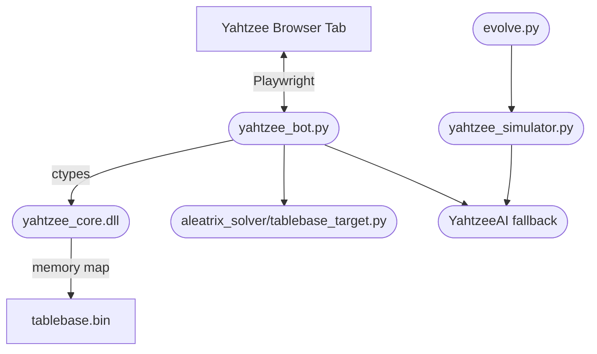

# Aleatrix Solver

Aleatrix Solver is a Yahtzee AI research and automation toolkit. It combines a
Python game simulator, a browser controller, and a C++ win-probability tablebase
engine.

The main solver can use a generated 5.57 GB tablebase for fast optimal
win-probability lookups. For normal setup, download the precomputed tablebase
from Hugging Face. For verification-minded users, the C++ generator remains in
the repo as an advanced local rebuild path.

## Quick Start for Windows

Prerequisites:

- Python 3.12+.
- Git.
- Visual Studio 2022 Build Tools with the C++ workload, or another CMake/MSVC setup.

Clone and enter the repo:

```powershell
git clone https://github.com/YatzCore/aleatrix-solver.git
cd aleatrix-solver
```

Run the setup script:

```powershell
python scripts/setup_windows.py
```

The script installs Python dependencies, installs Playwright Chromium, builds
the C++ DLL, downloads the verified tablebase from Hugging Face, and runs the
Python/C++ tests. If CMake is installed but not on `PATH`, pass it explicitly:

```powershell
python scripts/setup_windows.py --cmake "C:\Path\To\cmake.exe"
```

Start the standalone browser controller:

```powershell
python -u yahtzee_bot.py
```

## Architecture



## Features

- C++ win-probability tablebase engine for 696,418,304 encoded game states.
- Python expectiminimax fallback for states where score maximization is safer.
- Local simulator for strategy testing and opponent-score validation.
- Playwright browser controller with a live overlay and human-paced actions.
- Game-history routing that keeps incomplete or dirty records out of clean logs.
- Tablebase downloader with byte-size and SHA-256 verification.

## Repository Layout

- [yahtzee_bot.py](yahtzee_bot.py): browser controller and tablebase integration.
- [yahtzee_simulator.py](yahtzee_simulator.py): local simulation runner.
- [evolve.py](evolve.py): Optuna-based strategy tuning entry point.
- [strategy_tuner.py](strategy_tuner.py): deterministic grid-search strategy tools.
- [aleatrix_solver/](aleatrix_solver/): reusable solver, strategy, tablebase-targeting, and history modules.
- [cpp/](cpp/): C++ solver, DLL wrapper, generator, and core tests.
- [scripts/](scripts/): setup, tablebase download/upload, release, and maintenance utilities.
- [tests/](tests/): Python unittest suite.
- [docs/examples/game_history.sample.jsonl](docs/examples/game_history.sample.jsonl): sanitized example log.

## Manual Setup

Install Python dependencies:

```powershell
pip install -r requirements.txt
python -m playwright install chromium
```

Build the C++ DLL and tests:

```powershell
cmake -S cpp -B cpp/build -DCMAKE_BUILD_TYPE=Release
cmake --build cpp/build --config Release
```

Download the precomputed tablebase:

```powershell
python scripts/download_tablebase.py --repo-id YatzCore/aleatrix-solver-tablebase
```

This writes:

- `cpp/tablebase.bin`
- `cpp/tablebase.meta.json`
- `cpp/tablebase.sha256`

The downloader verifies the expected byte size and SHA-256 checksum before it
reports success.

## Running

Standalone Playwright browser:

```powershell
python -u yahtzee_bot.py
```

Attach to an existing Chrome session:

```powershell
& "$env:LOCALAPPDATA\Google\Chrome\Application\chrome.exe" --remote-debugging-port=9222 --user-data-dir="C:\ChromeDebug"
python -u yahtzee_bot.py --connect
```

Open a Yahtzee page in the debug Chrome window, then use the injected control
panel to start or pause the controller.

## Testing

Run Python tests:

```powershell
python -m unittest discover -s tests -t . -v
```

Run C++ tests after building:

```powershell
.\cpp\build\Release\yahtzee_core_tests.exe
```

## Advanced: Rebuild the Tablebase

The precomputed tablebase is distributed separately because it is too large for
GitHub. If you prefer to regenerate it locally:

```powershell
cmake -S cpp -B cpp/build -DCMAKE_BUILD_TYPE=Release
cmake --build cpp/build --config Release
.\cpp\build\Release\yahtzee_core.exe --layers 13 --output cpp/tablebase.bin
```

On a high-core desktop this can still take hours. On slower machines it can take
much longer, which is why the Hugging Face artifact exists.

Prepare release metadata for a regenerated tablebase:

```powershell
python scripts/prepare_tablebase_release.py
```

Upload requires a local Hugging Face login:

```powershell
huggingface-cli login
python scripts/upload_tablebase_hf.py --repo-id YatzCore/aleatrix-solver-tablebase
```

## Responsible Use

This project is not affiliated with Solitaired or any other Yahtzee website.
Use browser automation only where it is permitted by the site's terms and by the
people you play with. The solver and simulator are useful as local research
tools even without live browser automation.

## License

MIT. See [LICENSE](LICENSE).
