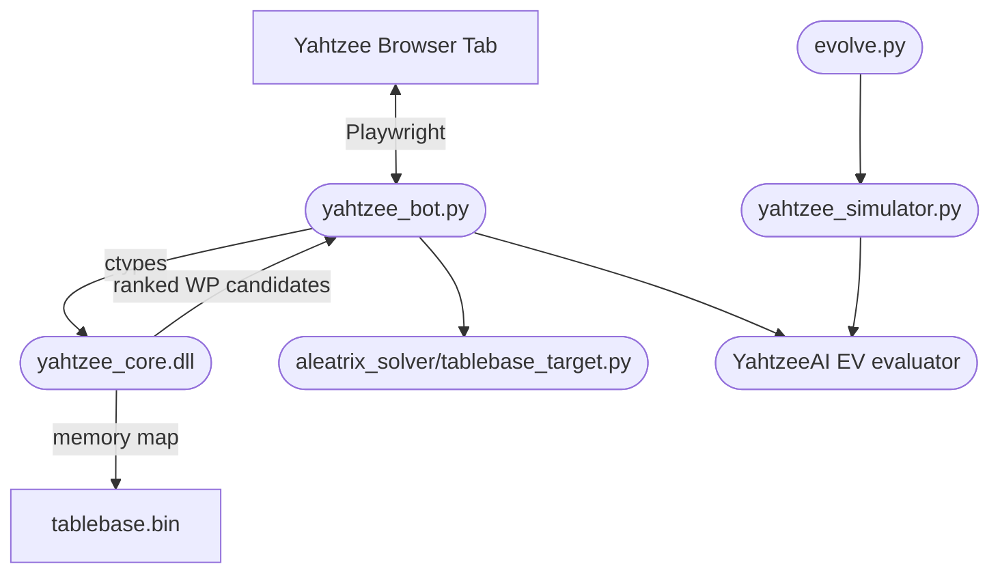

# Aleatrix Solver

Aleatrix Solver is a Yahtzee AI research and automation toolkit. It combines a
Python game simulator, a browser controller, and a C++ win-probability tablebase
engine.

The main solver can use a generated 5.57 GB tablebase for fast optimal
win-probability lookups. For normal setup, download the precomputed tablebase
from Hugging Face. For verification-minded users, the C++ generator remains in
the repo as an advanced local rebuild path.

## Quick Start for Windows

Prerequisites:

- Python 3.12+.
- At least 7 GB of free disk space for the tablebase and dependencies.

1. Download
   [aleatrix-solver-v1.0.0-windows-x64.zip](https://github.com/YatzCore/aleatrix-solver/releases/download/v1.0.0/aleatrix-solver-v1.0.0-windows-x64.zip)
   from the [latest GitHub Release](https://github.com/YatzCore/aleatrix-solver/releases/latest).
2. Extract the ZIP to a normal writable folder.
3. Double-click `SETUP_WINDOWS.bat`.
4. After setup finishes, double-click `RUN_BOT.bat`.

The release already contains the compiled C++ runtime. Git, CMake, and Visual
Studio are not required. Setup installs the Python dependencies and Playwright
Chromium, downloads the verified tablebase, and runs the included tests.

The default `unified` mode uses the C++ tablebase to shortlist moves and the
Python EV evaluator to choose within a bounded win-probability epsilon. The
legacy fallback policy remains available as a compatibility option:

```powershell
python -u yahtzee_bot.py --solver-mode hybrid
```

## Architecture



## Features

- C++ win-probability tablebase engine for 696,418,304 encoded game states.
- Default unified solver that maximizes EV inside a dynamic tablebase WP window.
- Legacy hybrid solver available as an explicit compatibility mode.
- Local simulator for strategy testing and opponent-score validation.
- Playwright browser controller with a live overlay and human-paced actions.
- Game-history routing that keeps incomplete or dirty records out of clean logs.
- Tablebase downloader with byte-size and SHA-256 verification.

## Repository Layout

- [yahtzee_bot.py](yahtzee_bot.py): browser controller and tablebase integration.
- [yahtzee_simulator.py](yahtzee_simulator.py): local simulation runner.
- [evolve.py](evolve.py): Optuna-based strategy tuning entry point.
- [strategy_tuner.py](strategy_tuner.py): deterministic grid-search strategy tools.
- [aleatrix_solver/](aleatrix_solver/): reusable solver, strategy, tablebase-targeting, and history modules.
- [cpp/](cpp/): C++ solver, DLL wrapper, generator, and core tests.
- [scripts/](scripts/): setup, tablebase download/upload, release, and maintenance utilities.
- [tests/](tests/): Python unittest suite.
- [docs/examples/game_history.sample.jsonl](docs/examples/game_history.sample.jsonl): sanitized example log.

## Tablebase Download

The 5.57 GB tablebase is hosted in the public
[Hugging Face dataset](https://huggingface.co/datasets/YatzCore/aleatrix-solver-tablebase).
No Hugging Face account or access token is required. `SETUP_WINDOWS.bat`
downloads these files directly into `cpp/`:

- `tablebase.bin`
- `tablebase.meta.json`
- `tablebase.sha256`

The downloader checks the exact byte size and SHA-256 before reporting success.
It does not keep a second full copy in the global Hugging Face cache.

To download it manually:

```powershell
python scripts/download_tablebase.py --repo-id YatzCore/aleatrix-solver-tablebase
```

## Build from Source

Source builds require Git, CMake, and Visual Studio 2022 Build Tools with the
Desktop development with C++ workload.

Clone the repo:

```powershell
git clone https://github.com/YatzCore/aleatrix-solver.git
cd aleatrix-solver
```

Run the full source setup:

```powershell
python scripts/setup_windows.py
```

This installs Python dependencies and Playwright Chromium, builds the C++
runtime, downloads the tablebase, and runs the test suites.

If CMake is installed but not on `PATH`, pass it explicitly:

```powershell
python scripts/setup_windows.py --cmake "C:\Path\To\cmake.exe"
```

## Running

Standalone Playwright browser:

```powershell
python -u yahtzee_bot.py
```

Legacy hybrid solver:

```powershell
python -u yahtzee_bot.py --solver-mode hybrid
```

Attach to an existing Chrome session:

```powershell
& "$env:LOCALAPPDATA\Google\Chrome\Application\chrome.exe" --remote-debugging-port=9222 --user-data-dir="C:\ChromeDebug"
python -u yahtzee_bot.py --connect
```

Open a Yahtzee page in the debug Chrome window, then use the injected control
panel to start or pause the controller.

## Testing

Run Python tests:

```powershell
python -m unittest discover -s tests -t . -v
```

Run C++ tests after building:

```powershell
.\cpp\build\Release\yahtzee_core_tests.exe
```

Run a paired unified-policy evaluation:

```powershell
python scripts/run_unified_evaluation.py --games 10000 --seed 99 --configs dynamic_v1
```

The evaluator reuses identical dice seeds across policies and shuffles the
opponent-score pairing for the selected seed. Generated decision logs and
simulation result files are intentionally ignored by Git.

## Advanced: Rebuild the Tablebase

The precomputed tablebase is distributed separately because it is too large for
GitHub. If you prefer to regenerate it locally:

```powershell
cmake -S cpp -B cpp/build -DCMAKE_BUILD_TYPE=Release
cmake --build cpp/build --config Release
.\cpp\build\Release\yahtzee_core.exe --layers 13 --output cpp/tablebase.bin
```

On a high-core desktop this can still take hours. On slower machines it can take
much longer, which is why the Hugging Face artifact exists.

Prepare release metadata for a regenerated tablebase:

```powershell
python scripts/prepare_tablebase_release.py
```

Upload requires a local Hugging Face login:

```powershell
huggingface-cli login
python scripts/upload_tablebase_hf.py --repo-id YatzCore/aleatrix-solver-tablebase
```

## Responsible Use

This project is not affiliated with Solitaired or any other Yahtzee website.
Use browser automation only where it is permitted by the site's terms and by the
people you play with. The solver and simulator are useful as local research
tools even without live browser automation.

## License

MIT. See [LICENSE](LICENSE).
